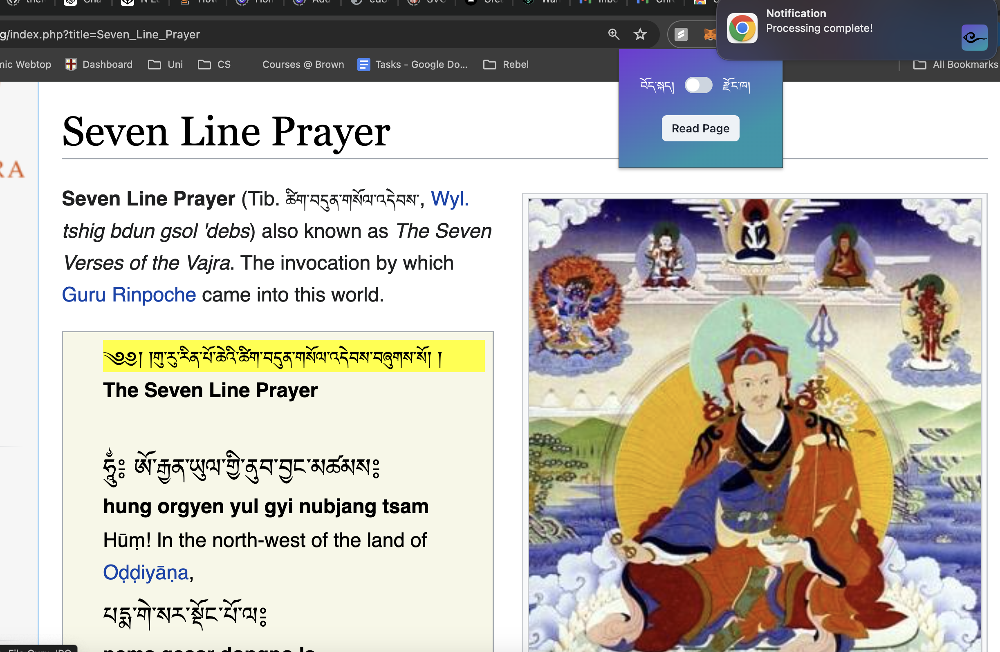

# Sungsho Chrome Extension

A browser extension designed to read aloud text on web pages in Dzongkha or Tibetan. Whether you're a native speaker, a language learner, or simply someone interested in these languages, this extension provides a seamless way to listen to content in Dzongkha or Tibetan as you browse the web.

